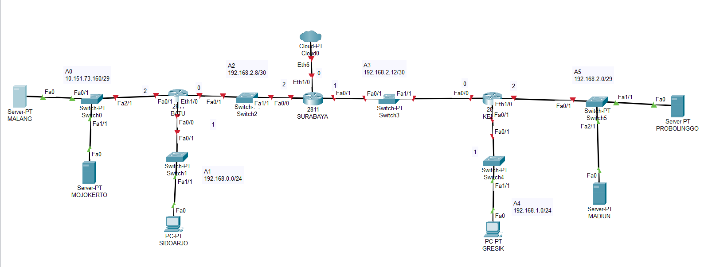
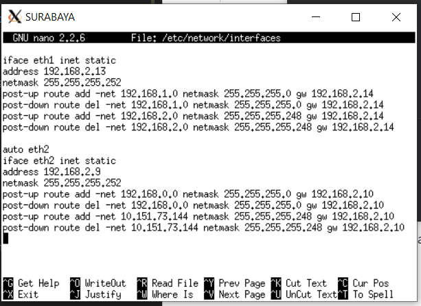
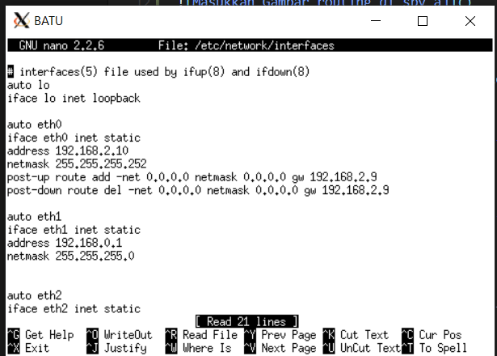
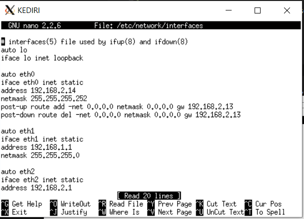
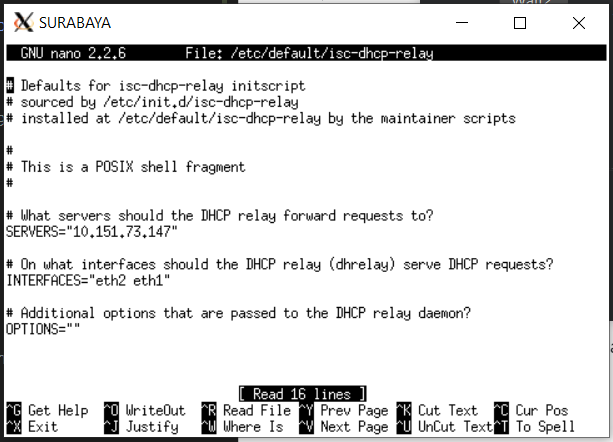
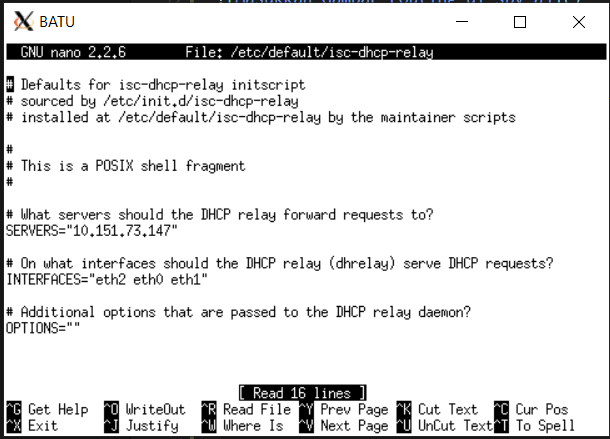
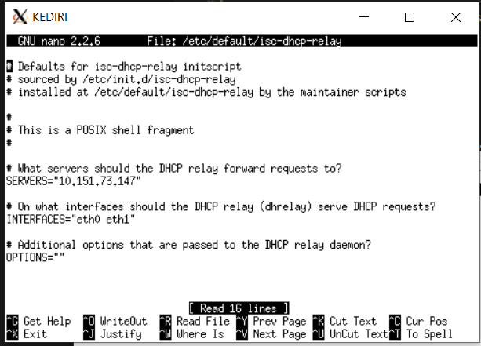

# Jarkom_Modul5_Lapres_T02

### A

Membuat Topologi sesuai dengan soal

### B & C

Routing dengan VLSM

### D

DHCP Server --> Mojokerto, mengarah ke Sidoarjo dan Gresik
(Relay di Batu, Surabaya, Kediri)

### Nomor 1

`iptables -t nat -A POSTROUTING -o eth0 -s 192.160.0.0/16 -j SNAT --to-source 10.151.73.74`

### Nomor 2

`iptables -A FORWARD -d 10.151.73.144 -p tcp --dport 22 -s IP TUNTAP -j DROP`

### Nomor 3

`iptables -A INPUT -p ICMP -m connlimit --connlimit-above 3 --connlimit-mask 0 -j DROP`

### Nomor 4

`iptables -A INPUT -s 192.168.0.0/24 -m time --timestart 00:00 --timestop 06:59 --weekdays Mon,Tue,Wed,Thu,Fri -j REJECT`

`iptables -A INPUT -s 192.168.0.0/24 -m time --timestart 17:01 --timestop 23:59 --weekdays Mon,Tue,Wed,Thu,Fri -j REJECT`

`iptables -A INPUT -s 192.168.0.0/24 -m time --weekdays Sat,Sun -j REJECT`

### Nomor 5

`iptables -A INPUT -s 192.168.1.0/24 -m time --timestart 07:01 --timestop 16:59 -j REJECT`

### Nomor 6

`iptables -t nat -A PREROUTING -p tcp --dport 80 -m state --state NEW -m statistic --mode nth --every 2 --packet 0 -j DNAT --to-destination 10.0.0.3:80`

`iptables -t nat -A PREROUTING -p tcp --dport 80 -m state --state NEW -m statistic --mode nth --every 1 --packet 0 -j DNAT --to-destination 192.168.0.2:80`

### Nomor 7

`iptables -A INPUT -j LOG --log-prefix "INPUT:DROP:" --log-level 6`

`iptables -t filter -A FORWARD -p udp -d 192.168.2.2 --dport 80 -j ACCEPT`

`iptables -t filter -A FORWARD -p udp -s 192.168.2.2 --sport 80 -j ACCEPT`

`iptables -t filter -A FORWARD -p udp -d 192.168.2.3 --dport 80 -j ACCEPT`

`iptables -t filter -A FORWARD -p udp -s 192.168.2.3 --sport 80 -j ACCEPT`

### Flushing iptables

`iptables -F`

`iptables -t nat -F`
